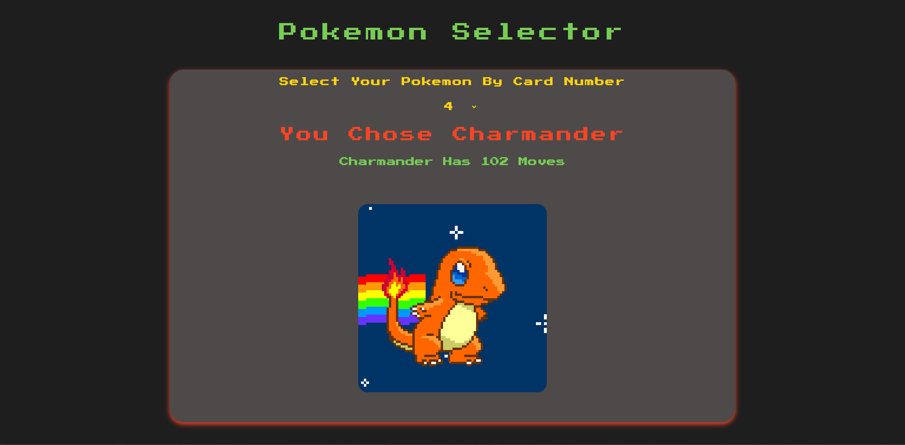

# Pokémon Selector

## Description

Welcome to the Pokémon Selector! This project is a fun and engaging web application that brings the exciting world of Pokémon to life. Users can explore various Pokémon, learn about their moves, and enjoy a visually appealing experience in a Pokémon-themed environment.

## Features

- Choose a Pokémon via their official Card Number.
- View the number of moves the selected Pokémon has.
- Enjoy a Pokémon-themed color palette and design.
- Interact with user-friendly components for seamless navigation.

## Installation

1. Clone this repository to your local machine.
2. Navigate to the project directory.
3. Run `npm install` to install the required dependencies.
4. Start the development server using `npm start`.

## Technologies Used

- React: Front-end JavaScript library for building user interfaces.
- Axios: HTTP client for making API requests.
- Figma: UI design tool to create a responsive UI.

## Credits

- Pokémon data sourced from the [PokéAPI](https://pokeapi.co/).
- GIFs sourced from the [Giphy API](https://developers.giphy.com/).

---

Enjoy your journey into the world of Pokémon! Gotta catch 'em all!
